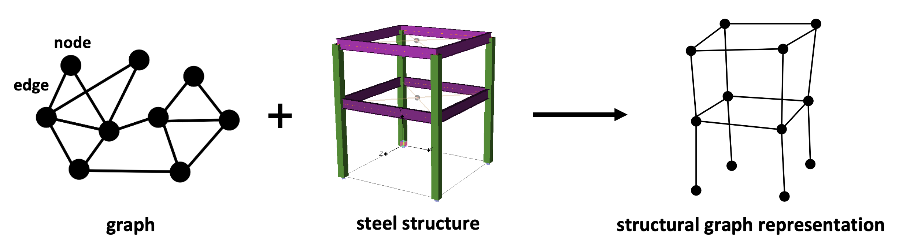
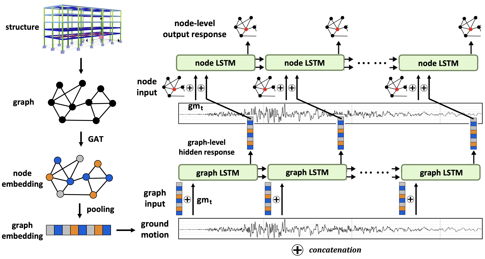
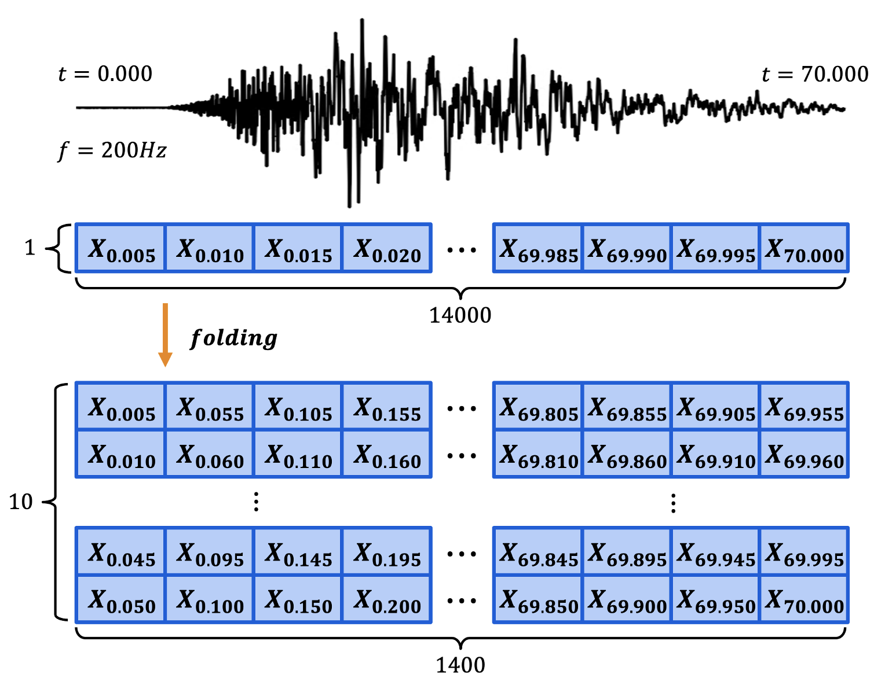
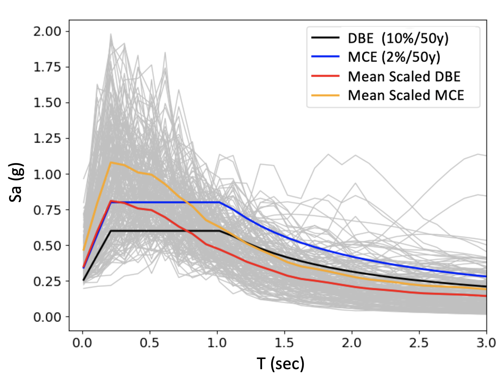
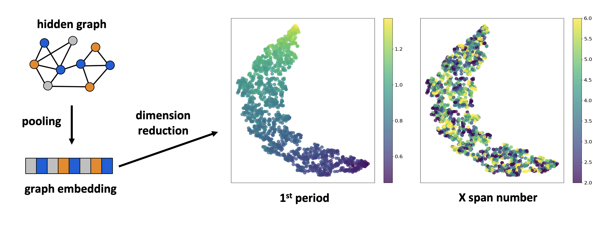

# GraphLSTM-nonlinear-dynamic-analysis
**Title: Inductive Graph-Based Long Short-Term Memory Network for the Prediction of Nonlinear Floor Responses and Member Forces of Steel Buildings Subjected to Orthogonal Horizontal Ground Motions**

Authors: Yuan-Tung Chou, Po-Chih Kuo, Kuang-Yao Li, Wei-Tze Chang, Yin-Nan Huang*, Chuin-Shan Chen*

## Abstract
This paper introduces a novel hierarchical graph-based long short-term memory network designed for predicting the nonlinear seismic responses of building structures. We represent buildings as graphs with nodes and edges and utilize graph neural network (GNN) and long short-term memory (LSTM) technology to predict their responses when subjected to orthogonal horizontal ground motions. The model was trained using the results of nonlinear response-history analyses using 2000 sample 4- to 7-story steel buildings and 88 pairs of ground-motion records from earthquakes with a moment magnitude greater than 6.0 and closest site-to-fault distance shorter than 20 km. The results demonstrate the model’s great performance in predicting floor acceleration, velocity, and displacement, as well as shear force, bending moment, and plastic hinges in beams and columns. Furthermore, the model has learned to recognize the significance of the first mode period of a building. The model’s robust generalizability across diverse building geometry and its comprehensive predictions of floor responses and member forces position it as a potential surrogate model for the response-history analysis of buildings.

